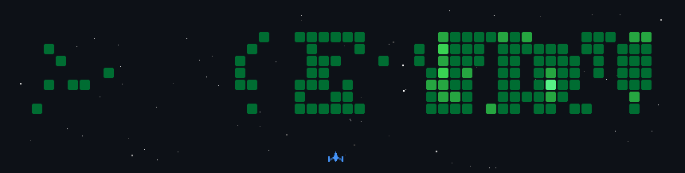

<!-- Heading -->

  
  

    
    
    
  

  

    
    
    
  

  

<!-- About Me -->
<h1 align = "center">Who I Am</h1>

  I'm a final-year ECE student at BIT Mesra (graduating 2027). I spend most of my time building full-stack web apps, solving competitive programming problems (1000+ DSA problems, LeetCode Knight), and going down rabbit holes about how distributed systems actually work.

A few things I'm proud of from the past year:

- **Codefolio**: An app to organize all your coding profiles in a single place and track your progress.
- **GithubGPT**: Developed a GitHub-aware RAG assistant.
- **Multiplayer Typing Racer**: An online socket.io based 1v1-5 multiplayer typing racer game.
- **Smart Mess Management**: A full-stack digital solution for hostel mess management.

I care a lot about whether what I build actually works when people use it.

I'm looking for **full-time SDE roles starting 2027**, and I'm also open to remote work or freelance collaborations if you're building something interesting in the meantime.

  
  

<!-- GitHub Stats -->

  <h1>📊 GitHub Stats</h1>
   
  

    
      
    
    
    
  

   
  <picture>
    <source media="(prefers-color-scheme: dark)" srcset="https://raw.githubusercontent.com/walidbosso/walidbosso/pacman/pacman-contribution-graph-dark.svg">
    <source media="(prefers-color-scheme: light)" srcset="https://raw.githubusercontent.com/walidbosso/walidbosso/pcman/pacman-contribution-graph.svg">
    
  </picture>
  

<!-- Coding Activity -->

  <h1>📈 Coding Activity</h1>
   
  
    
  

<!-- Experience -->

<!-- Technical Stack -->

  <h1>🛠️ Technical Arsenal</h1>
  
<b>Core Languages & Databases</b>

  
  
<b>Frontend & Design</b>

   
  
<b>Backend, Cloud & DevOps</b>

  
  
<b>Tools</b>

  
    
  

    
    
    
  

  

<!-- Projects -->

  <h1> Projects</h1>
  <table align="center">
    <tr>
      <td width="50%" valign="top">
        <h3 align="center">Codefolio</h3>
        

          
          
        

        
<b>React.js · JavaScript · RESTful APIs</b>

        <ul>
          <li>An app to organize all your coding profiles in a single place and track your progress.</li>
        </ul>
      </td>
      <td width="50%" valign="top">
        <h3 align="center">CanteenIQ - Smart Mess Management</h3>
        

          
          
        

        
<b>React.js · JavScript · MongoDB · Flask</b>

        <ul>
          <li>A full-stack digital solution for hostel mess management at Birla Institute of Technology, Mesra.</li>
        </ul>
      </td>
    </tr>
    <tr>
      <td width="50%" valign="top">
        <h3 align="center">TypingRacer</h3>
        

          
          
        

        
<b>TypeScript · Next.js · Socket.io </b>

        <ul>
          <li>A scalable multiplayer typing racer platform made using websockets.</li>
        </ul>
      </td>
      <td width="50%" valign="top">
        <h3 align="center">Portfolio Website</h3>
        

          
          
        

        
<b>React · TailwindCSS</b>

        <ul>
          <li>✅ 30% reduction in check-in time</li>
          <li>✅ Offline validation support</li>
        </ul>
      </td>
    </tr>
  </table>
  

<!-- Achievements -->

<!-- Random Dev Quote -->

   
  
  
  

  

